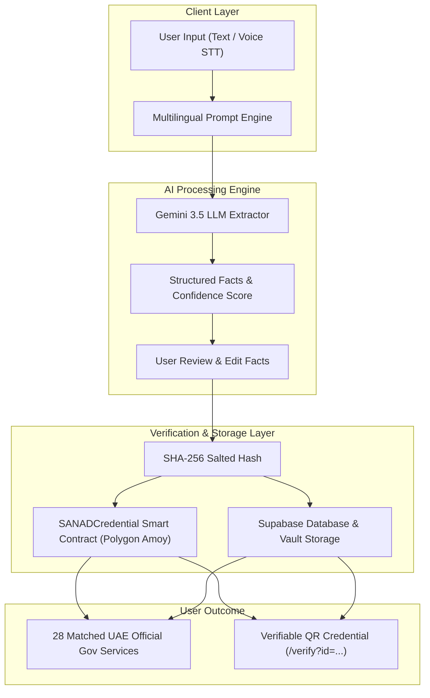

# 🛡️ SANAD | سند

<div align="center">


**"Understand your situation. Prove what matters. Find the support you need."**

[🌐 Live Web Platform](https://sanad-ebon.vercel.app) • [📄 API Reference](docs/api.md) • [⛓️ Blockchain Guide](docs/blockchain.md) • [🏗️ Architecture Specs](docs/architecture.md)

</div>

---

## 🌟 What is SANAD?

**SANAD (سند)** is an AI-powered multilingual situation navigator combined with a portable, zero-PII verifiable credential system. It empowers workers, residents, and individuals to naturally explain complex life situations in mixed languages (Hinglish, Arabizi, Urdu-English, Arabic-English), extract structured facts, generate cryptographic proof of their confirmed claims, and dynamically connect with **28 verified official UAE government service portals**.

> [!IMPORTANT]
> **Live Production Deployment**: SANAD is live on Vercel connected to Supabase Database & Gemini 3.5 AI:  
> 👉 **[https://sanad-ebon.vercel.app](https://sanad-ebon.vercel.app)**

---

## 🎯 Hackathon Track Alignment

| Track | Challenge Area | Demonstrated Capabilities in SANAD |
|-------|----------------|------------------------------------|
| **Track 1: AI / ML** | *Code-Switching & Spelling by Ear* | • Hinglish, Arabizi, Urdu-English & Arabic-English intent recognition<br>• Structured fact extraction with LLM confidence scoring<br>• User-editable fact verification UI<br>• Speech-to-Text (STT) voice input & Text-to-Speech (TTS) |
| **Track 2: Blockchain / Web3** | *Verification Assumes Settled Residency* | • Portable, zero-PII cryptographic claim hashing (SHA-256)<br>• Smart Contract (`contracts/SANADCredential.sol`) on Polygon Amoy (80002)<br>• Issuer-controlled minting & on-chain revocation<br>• Public verification route (`/verify?id=...`) & QR code generation |
| **Track 3: Web & Accessibility** | *Interfaces That Change Silently* | • Dynamic status announcer (`aria-live="polite"` / `aria-live="assertive"`)<br>• Full keyboard navigation & focus trap management<br>• High-contrast, reduced motion, and large-text accessibility modes<br>• Real-time application lifecycle timeline tracking |

---

## 🏗️ Platform Architecture



---

## 📋 Official Government Resource Network (28 Categories)

SANAD automatically maps confirmed user situations to **28 verified UAE official government portals**:

```text
🏛️ LABOUR & WAGES          • MOHRE Private Sector Complaints, Wage Protection, Worker Rights
🏠 HOUSING & TENANCY        • Ejari Contract Registration, Rental Dispute Settlement Centre (RDC)
⚖️ JUSTICE & LEGAL AID      • Ministry of Justice Free Legal Advice & Judicial Aid
🛍️ CONSUMER & COMMERCIAL    • Ministry of Economy Consumer Protection & Fraud Portal
🚀 BUSINESS & SME           • UAE Official Starting a Business & Entrepreneurship Portal
🛡️ INSURANCE & RELIEF       • Unemployment Insurance Scheme (ILOE), End-of-Service Benefits, Red Crescent Aid
📜 VISAS & RESIDENCY        • ICP Emirates ID, Residence Visa Provisions, Student & Family Visas, DHA Insurance
```

---

## 🚀 Quick Start

### Prerequisites
- Node.js 22+ or Node.js 24
- npm 10+

### Installation & Local Setup

```bash
# 1. Clone repository
git clone https://github.com/maria-mustafa-b/sanad.git
cd sanad

# 2. Install dependencies
npm ci

# 3. Configure local environment
cp .env.example .env.local

# 4. Start local development server
npm run dev
```

Open [http://localhost:3000](http://localhost:3000) and click **Try Demo** to run the zero-config local simulation.

---

## ⚙️ Environment Configuration (`.env.local`)

```env
# Supabase Configuration
NEXT_PUBLIC_SUPABASE_URL=https://uarzykpuurrkicyzuwbp.supabase.co
NEXT_PUBLIC_SUPABASE_ANON_KEY=your_anon_key
SUPABASE_SERVICE_ROLE_KEY=your_service_role_key
SANAD_MODE=supabase

# AI Model Adapter
AI_PROVIDER=GEMINI
AI_API_KEY=your_gemini_api_key
AI_MODEL=gemini-3.5-flash-lite

# Blockchain Network (Polygon Amoy Testnet)
BLOCKCHAIN_MODE=mock # Change to 'real' for live PolygonScan transactions
POLYGON_AMOY_RPC_URL=https://rpc-amoy.polygon.technology/
SANAD_CONTRACT_ADDRESS=0xYourDeployedContractAddress
BLOCKCHAIN_PRIVATE_KEY=0xYourWalletPrivateKey
```

---

## 🧪 Quality Gates & Testing Suite

SANAD enforces 100% strict type safety and quality gates before code push:

```bash
# Run ESLint validation
npm run lint

# Run TypeScript strict type check
npm run typecheck

# Run unit tests
npm test

# Run Smart Contract test suite
npm run test:contract

# Test Next.js production build
npm run build

# Run Playwright End-to-End E2E test suite
npm run test:e2e
```

---

## 🔒 Security & Privacy Architecture

> [!NOTE]
> - **Zero PII On-Chain**: Personal identities, passport numbers, and full claim details are never stored on the blockchain. Only opaque UUIDs and salted SHA-256 hashes are recorded.
> - **Server-Side Security Role**: Supabase Row Level Security (RLS) blocks client-side database writes; all writes are routed through server actions & API guards.
> - **Cryptographic Verification**: Anyone can verify credential authenticity on `/verify?id=...` without revealing underlying private documents.

---

## 📄 License & Attribution

Designed and engineered for the 36-Hour Hackathon. Built with ❤️ for accessibility, inclusion, and transparency.
