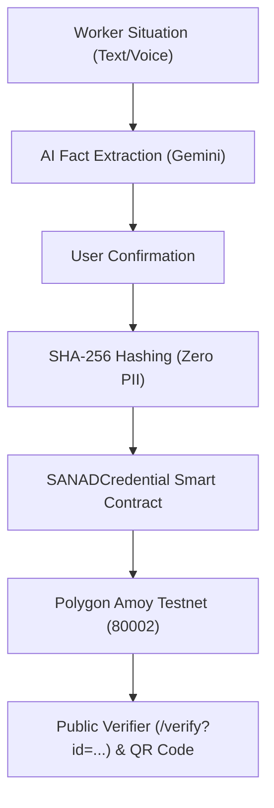

# ⛓️ SANAD Blockchain & Verifiable Credentials Guide

SANAD includes a production-grade Web3 architecture for issuing, verifying, and revoking **portable, zero-PII (Personally Identifiable Information) claims** on the EVM-compatible **Polygon Amoy Testnet (Chain ID 80002)**.

---

## 🏗️ 1. Architecture Overview



### Privacy-First Security Model
- **No PII on Chain:** Names, passport numbers, and raw situation details **never** touch the blockchain.
- **SHA-256 Digest:** Only the `recordHash` (cryptographic hash of confirmed facts) and `credentialId` (opaque UUID) are written to the smart contract.
- **Issuer Control:** Only authorized issuing entities can mint or revoke credentials.

---

## 📜 2. Smart Contract Specs (`contracts/SANADCredential.sol`)

`contracts/SANADCredential.sol` is written in **Solidity `^0.8.24`**:

```solidity
// SPDX-License-Identifier: MIT
pragma solidity ^0.8.24;

contract SANADCredential {
    address public immutable issuer;
    struct Credential { 
        bytes32 recordHash; 
        address issuedBy; 
        uint64 issuedAt; 
        bool revoked; 
    }
    mapping(bytes32 => Credential) private records;

    event Issued(bytes32 indexed id, bytes32 indexed recordHash, address indexed issuer);
    event Revoked(bytes32 indexed id);

    constructor() { issuer = msg.sender; }

    function issue(bytes32 id, bytes32 recordHash) external { ... }
    function revoke(bytes32 id) external { ... }
    function status(bytes32 id) external view returns (bytes32, address, uint64, bool) { ... }
}
```

---

## 🧪 3. Running Local Smart Contract Tests

SANAD comes with a local Solidity execution suite powered by `ethers` and `solc`:

```powershell
npm run test:contract
```

**What it tests:**
- ✅ Issuer-only minting & revoking permissions
- ✅ Immutability of recorded hashes
- ✅ Rejection of duplicate credential IDs
- ✅ On-chain revocation verification

---

## 🚀 4. How to Deploy to Polygon Amoy Testnet

### Step 1: Get Polygon Amoy Testnet MATIC
1. Get free testnet MATIC tokens from the official faucet:
   👉 [Polygon Amoy Faucet](https://faucet.polygon.technology/)

### Step 2: Deploy Using the Deployment Script
Run the automated deployment script included in SANAD:

```powershell
node scripts/deploy-contract.mjs
```

**Output example:**
```text
SANAD_CONTRACT_ADDRESS=0x1234567890abcdef1234567890abcdef12345678
Transaction=0xabcdef1234567890abcdef1234567890abcdef1234567890abcdef1234567890
```

---

## ⚙️ 5. Configuring `.env.local`

### Mode A: Mock / Simulation Mode (Default — Best for Live Hackathon Demos)
Requires zero gas fees and zero network latency.

```env
BLOCKCHAIN_MODE=mock
```

### Mode B: Real Polygon Amoy Testnet Mode
Executes live transactions on the Polygon blockchain.

```env
BLOCKCHAIN_MODE=real
POLYGON_AMOY_RPC_URL=https://rpc-amoy.polygon.technology/
SANAD_CONTRACT_ADDRESS=0xYourDeployedContractAddress
BLOCKCHAIN_PRIVATE_KEY=0xYourIssuerWalletPrivateKey
```

---

## 🔍 6. How Verification Works

1. **In App:** User completes claim → receives QR Code & Credential URL (`/verify?id=<credential_id>`).
2. **Public Verification Page:** Anyone (employers, legal aid, judges) can open `/verify?id=...` to verify:
   - Valid hash match
   - Polygon block timestamp
   - Revocation status
   - PolygonScan transaction link: `https://amoy.polygonscan.com/tx/<transaction_hash>`
