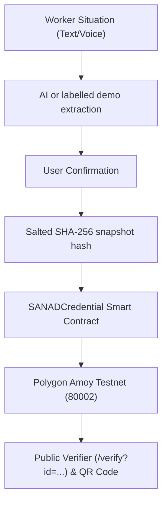

# ⛓️ SANAD Blockchain & Verifiable Credentials Guide

SANAD includes a prototype registry for issuing, verifying, and revoking portable **user-confirmed** records on the EVM-compatible **Polygon Amoy Testnet (Chain ID 80002)**. The default local demo is a labelled simulation; a live Amoy deployment has not been verified for this repository. A credential does not prove that the underlying claim is true or establish eligibility.

---

## 🏗️ 1. Architecture Overview



### Privacy-First Security Model
- **No raw personal details on chain:** The contract stores no name, passport number, situation text, document, private snapshot or salt. The padded UUID can still be correlated with a shared verification link, so share it intentionally.
- **SHA-256 digest:** The `recordHash` is computed over a canonical confirmed snapshot with a random 32-byte private salt and a domain prefix; only the hash and opaque ID are written to the contract.
- **Issuer control:** This contract has one immutable issuer wallet. Only that wallet can issue or revoke; it is not a multi-organization issuer system.

---

## 📜 2. Smart Contract Specs (`contracts/SANADCredential.sol`)

`contracts/SANADCredential.sol` is written in **Solidity `^0.8.24`**:

```solidity
// SPDX-License-Identifier: MIT
pragma solidity ^0.8.24;

contract SANADCredential {
    address public immutable issuer;
    struct Credential {
        bytes32 recordHash;
        address issuedBy;
        uint64 issuedAt;
        bool revoked;
    }
    mapping(bytes32 => Credential) private records;

    event Issued(bytes32 indexed id, bytes32 indexed recordHash, address indexed issuer);
    event Revoked(bytes32 indexed id);

    constructor() { issuer = msg.sender; }

    function issue(bytes32 id, bytes32 recordHash) external { ... }
    function revoke(bytes32 id) external { ... }
    function status(bytes32 id) external view returns (bytes32, address, uint64, bool) { ... }
}
```

---

## 🧪 3. Running Local Smart Contract Tests

SANAD comes with a local Solidity execution suite powered by `ethers` and `solc`:

```bash
npm run test:contract
```

**What it tests:**
- ✅ Issuer-only minting & revoking permissions
- ✅ Immutability of recorded hashes
- ✅ Rejection of duplicate credential IDs
- ✅ Revocation state on the local Ganache chain
- ✅ Positive contract issue timestamp

---

## 🚀 4. How to Deploy to Polygon Amoy Testnet

### Step 1: Set up a dedicated testnet issuer wallet
1. Create a **dedicated testnet-only** issuer wallet. Keep the private key and recovery phrase out of GitHub and chat. Do not use a wallet that holds real assets.
2. Obtain test POL for its **public address** using a faucet linked from [Polygon's current faucet guide](https://docs.polygon.technology/tools/gas/matic-faucet/). The former official Polygon faucet is no longer available; the guide lists third-party options. Test tokens have no monetary value.
3. Choose an Amoy RPC endpoint from [Polygon's current network reference](https://docs.polygon.technology/pos/reference/rpc-endpoints/) (chain ID 80002). The listed public endpoint is `https://polygon-amoy.drpc.org`; public endpoints may have rate limits. Put `POLYGON_AMOY_RPC_URL` and `BLOCKCHAIN_PRIVATE_KEY` in your ignored local `.env.local`. Never put the private key in a `NEXT_PUBLIC_` variable.

### Step 2: Run a read-only preflight

```bash
npm run deploy:check
```

This prints the public issuer address, test POL balance, estimated deployment gas and buffered cost. It checks that the RPC is Amoy and that the wallet can cover the estimate. It does **not** send a transaction or print the private key. If `SANAD_CONTRACT_ADDRESS` is already set, it checks that code exists at that address and that the configured wallet is its issuer.

### Step 3: Deploy using the deployment script
When the preflight passes and `SANAD_CONTRACT_ADDRESS` is still blank, run:

```bash
npm run deploy:contract
```

**Output example:**
```text
Transaction=0xabcdef1234567890abcdef1234567890abcdef1234567890abcdef1234567890
SANAD_CONTRACT_ADDRESS=0x1234567890abcdef1234567890abcdef12345678
```

---

## ⚙️ 5. Configuring `.env.local`

### Mode A: Mock / Simulation Mode (Default — Best for Live Hackathon Demos)
Requires zero gas fees and zero network latency.

```env
BLOCKCHAIN_MODE=mock
```

### Mode B: Real Polygon Amoy Testnet Mode
The contract can be deployed independently. **Issuing from the app** needs a persistent Supabase project with the migrations applied; the previous SANAD_2 project was deleted. The app must use the same issuer wallet that deployed the contract. Keep `BLOCKCHAIN_MODE=mock` until that database and the contract are both configured.

```env
BLOCKCHAIN_MODE=real
SANAD_MODE=supabase
POLYGON_AMOY_RPC_URL=<your Amoy RPC URL>
SANAD_CONTRACT_ADDRESS=0xYourDeployedContractAddress
BLOCKCHAIN_PRIVATE_KEY=0xYourIssuerWalletPrivateKey
```

---

## 🔍 6. How Verification Works

1. **In App:** User completes claim → receives QR Code & Credential URL (`/verify?id=<credential_id>`).
2. **Public Verification Page:** Anyone (employers, legal aid, judges) can open `/verify?id=...` to verify:
   - Valid hash match
   - Contract issue timestamp when the Amoy registry is configured and reachable
   - Revocation status
   - PolygonScan transaction link: `https://amoy.polygonscan.com/tx/<transaction_hash>`

The verifier recomputes the hash server-side from the private snapshot and salt. In real mode it compares that hash and revocation state with the contract. If chain revocation is visible before the database finishes updating, the public result still reports it as revoked. Private facts and documents are not returned by the verification API.

If a real transaction is broadcast but confirmation times out, its hash is retained and the record stays `PENDING` or `REVOKING`. The owner can use **Check confirmation** or `POST /api/credentials/:id/reconcile` to read its receipt. A failed issuance receipt changes the record to `FAILED`; a failed revocation receipt restores `VALID`. Mock mode has no real transaction hash and always displays **Demo/Testnet Simulation**.
